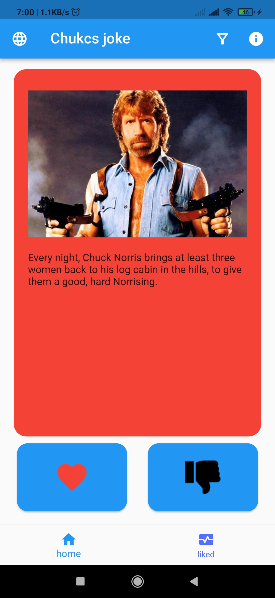
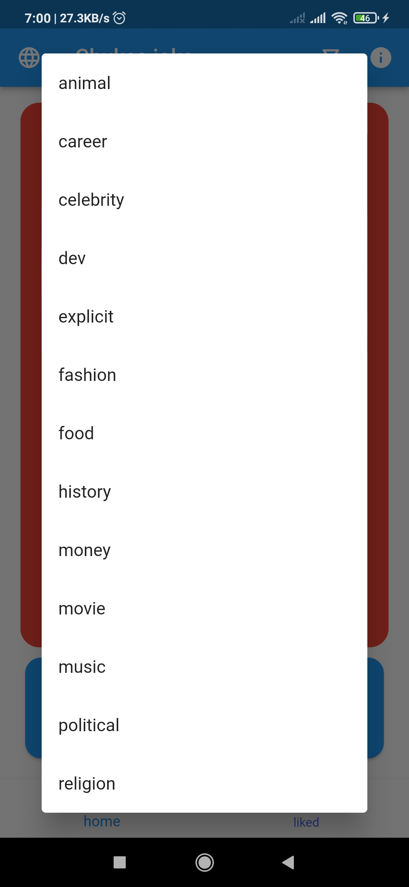
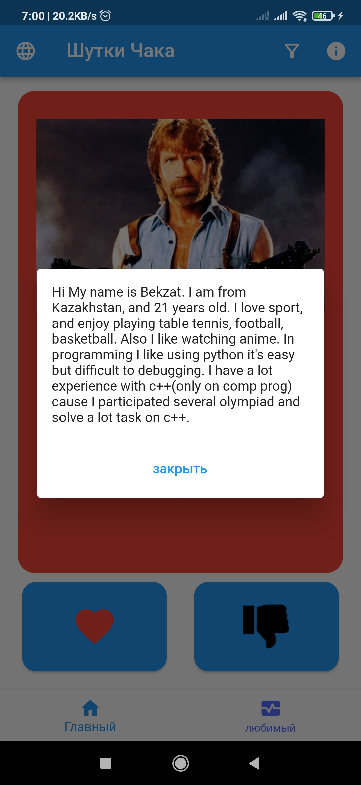
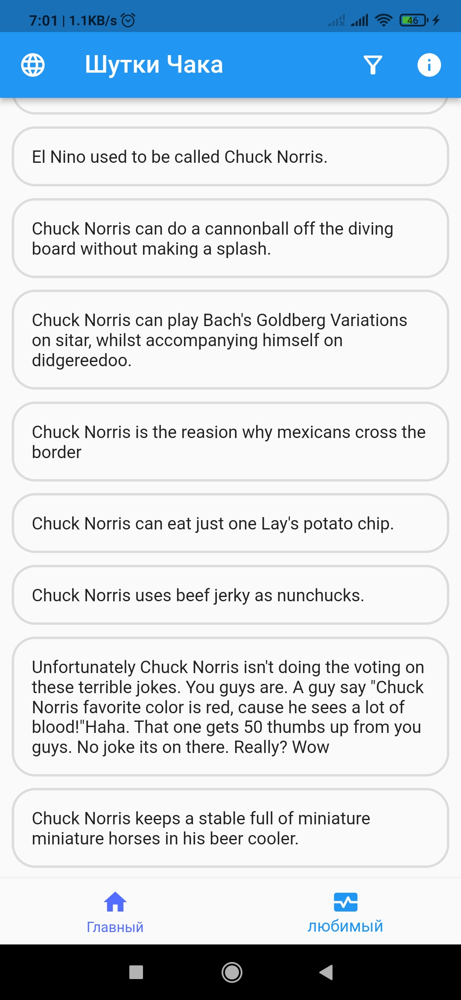
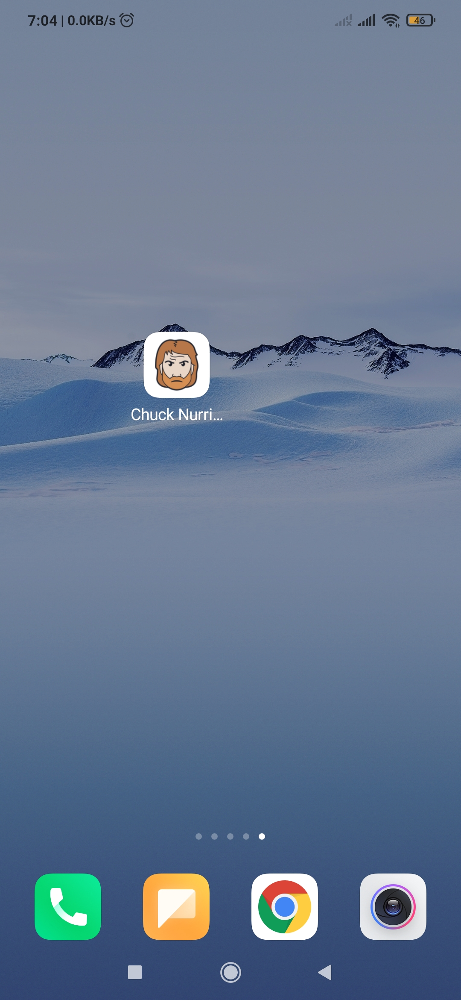

# Flutter course, assignment 1

__Chuck Norris jokes__

## Table content

- [Description](#description)
- [Images](#Demo)
- [Library](#library)
- [Code](#code)
- [APK](#APK)

## Description

This is the Flutter application which show image of the Chunk Norris and his joke. The app based on tinder appliction idea where you can swipe to  left if like and to right if it's not interesting, also  in bottom align two buttons like and dislike. In appbar I align the buttons which show dialog and information about me. 

--- 
### Updates

Implemented bottom navigation bar, where have two pages. First page is main page where show Chuck Norris jokes, this jokes was fetched using api. Second page show list of liked jokes. 

When you click on the appbar button language the app translate static words to russian languages, and clicking again app switch to the enlish language.  

## Images 

|                   Jokes                           |                        Categories              |                       dialog                   |     Liked jokes                    |   App icon
|:-------------------------------------------------:|:----------------------------------------------:|:----------------------------------------------:|:----------------------------------:|:------------------------------------------------:
|  |   |  |  | 

<!--     -->

## Library

- [http](https://pub.dev/packages/http) - This library used to fetch quotes from this [site](https://api.chucknorris.io/)
- [json_serializable](https://pub.dev/packages/json_serializable) - This library used to serialize JSON data into a model object. 
- [flutter_lints](https://pub.dev/packages/flutter_lints) - This library detect warnings and report them to the user.
- [build_runner](https://pub.dev/packages/build_runner) - This library used to generate __Joke.g.dart__ file.
- [hive](https://pub.dev/packages/hive) - This library used to store data in local storage.
- [flutter_bloc](https://pub.dev/packages/flutter_bloc) - This library is used to split UI and logic of application
- [easy_localization](https://pub.dev/packages/easy_localization) - This library is used to locolize text in local language

## Architecture and state management 

I used bloc state management and my architecture based on the following [repository](https://github.com/brianegan/flutter_architecture_samples/tree/master/bloc_library/lib).  To store constants I referenced to [this](https://stackoverflow.com/questions/54069239/whats-the-best-practice-to-keep-all-the-constants-in-flutter). 

## APK

[release-apk]()